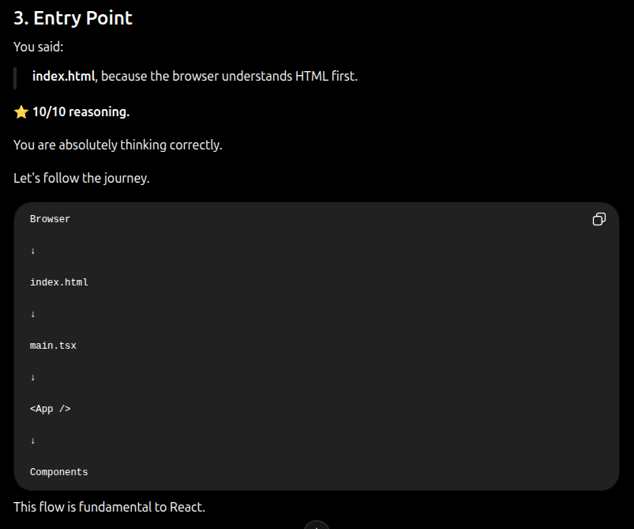
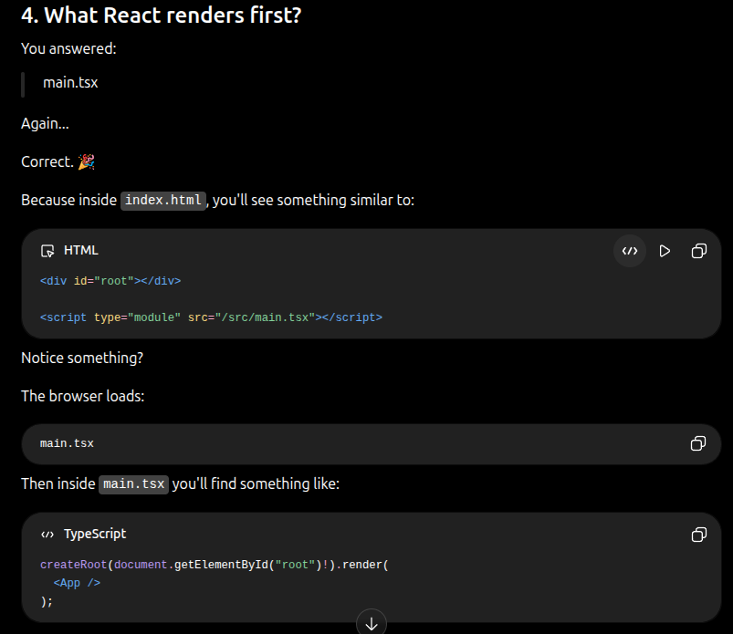
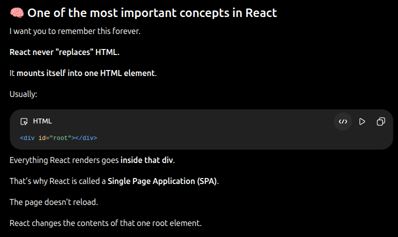

## What is the entry point of the client folder:

index.html, cause browser only understands html so it access html first then that html imports a js which contains all the converted react

## What file does react renders first:

main.tsx or whatever we import in the index.html

## Why React is called a Single Page Application (SPA)

## What createRoot() is responsible for

createRoot() creates a React root and tells React where to render the component tree in the DOM.

## What the ! operator means.

Its tells typescript to trust that the value will be not NULL. It only affects TypeScript's type checking. It does not perform any runtime null check.

## What <StrictMode> is and why React uses it.

React uses it for intentionally stressing the app in devlopment so we can find problems to debug in development instead of in production. Basically it act as QA testing

## Will the app still work without <StrictMode>

The application will still work because StrictMode is a development tool, not a runtime requirement. It helps identify potential problems early but doesn't provide functionality required for the application to run.

## CSS importing in components

A css file imported in a component is still global and not component level unless CSS Modules are used.

## Imports describe dependencies, not scope.

That applies to:

- CSS
- Images
- Fonts
- Utility functions
- JSON files

Almost everything.
